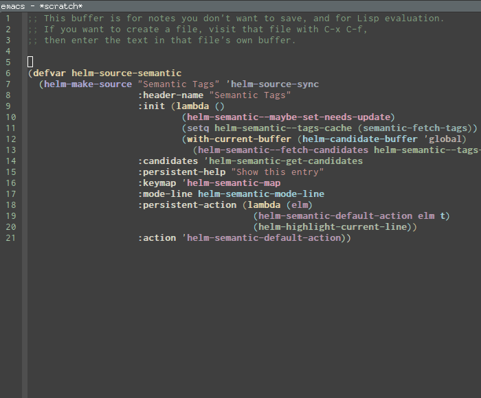
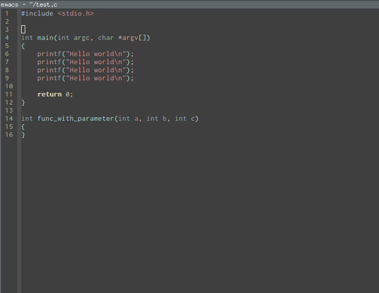

aggressive-indent-mode  
======================

`electric-indent-mode` is enough to keep your code nicely aligned when
all you do is type. However, once you start shifting blocks around,
transposing lines, or slurping and barfing sexps, indentation is bound
to go wrong.

**`aggressive-indent-mode`** is a minor mode that keeps your code **always**
indented. It reindents after every change, making it more reliable
than `electric-indent-mode`.

### Demonstration ###

- An example of Lisp mode (Emacs Lisp):

- An example of non-Lisp mode (C):

### Instructions ###

This package is available fom Melpa, you may install it by calling

    M-x package-install RET aggressive-indent

Then activate it with

    (add-hook 'emacs-lisp-mode-hook #'aggressive-indent-mode)
    (add-hook 'css-mode-hook #'aggressive-indent-mode)

You can use this hook on any mode you want, `aggressive-indent` is not
exclusive to emacs-lisp code. In fact, if you want to turn it on for
every programming mode, you can do something like:

    (global-aggressive-indent-mode 1)
    (add-to-list 'aggressive-indent-excluded-modes 'html-mode)

#### Manual Installation ####

If you don't want to install from Melpa, you can download it manually,
place it in your `load-path` along with its dependency `cl-lib` (which
you should already have if your `emacs-version` is at least 24.3).

Then require it with:

    (require 'aggressive-indent)

### Customization ###

The variable `aggressive-indent-dont-indent-if` lets you customize
when you **don't** want indentation to happen.
For instance, if you think it's annoying that lines jump around in
`c++-mode` because you haven't typed the `;` yet, you could add the
following clause:

    (add-to-list
     'aggressive-indent-dont-indent-if
     '(and (derived-mode-p 'c++-mode)
           (null (string-match "\\([;{}]\\|\\b\\(if\\|for\\|while\\)\\b\\)"
                               (thing-at-point 'line)))))

## Contribute ##

 
